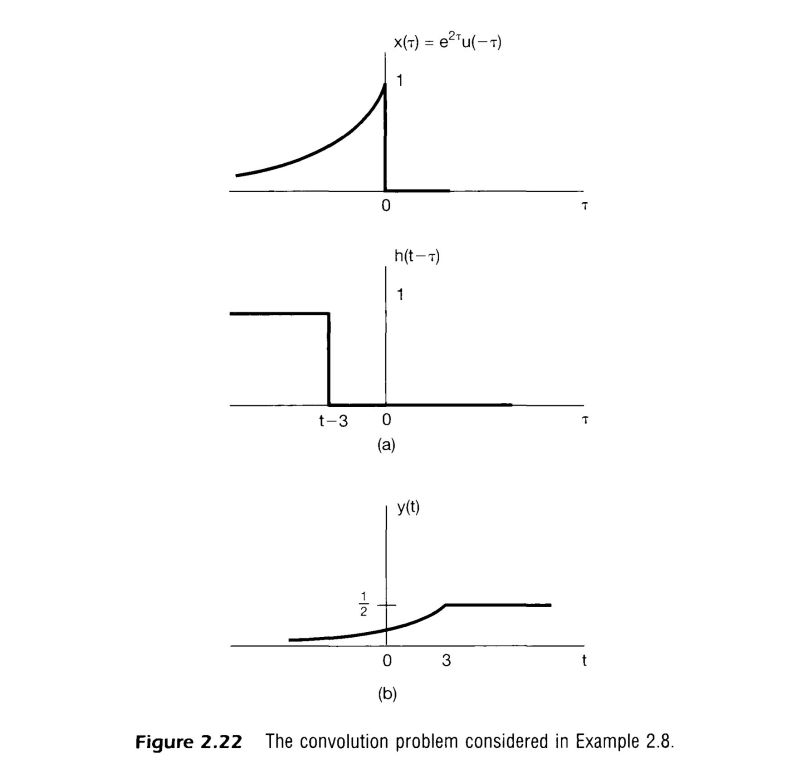
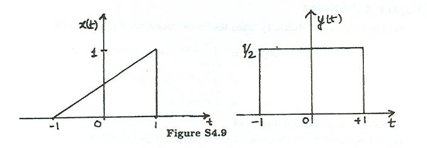

# 前四章小测

```{note}
总分 100 分
```

## 第一章

```{note}
25 分，三选二
```

1. 判断并简要解释下面的系统是否为线性系统：$y[n] = \mathcal{Re}\{x[n]\}$
   > 参考例题 1.19，作业题 1.29
   >
   > In checking the linearity of a system, it is
   > important to remember that the system must
   > satisfy both the additivity and homogeneity
   > properties and that the signals, as well as
   > any scaling constants, are allowed to be complex.
   >
   > Consider two inputs to the system such that
   >
   > $$
     x_1[n]\xrightarrow{S}y_1[n]=\mathrel{Re}\{x_1[n]\}
     \quad\text{and}\quad x_2[n]\xrightarrow{S}y_2[n]
     =\mathrel{Re}\{x_2[n]\}
     \text{.}
     $$
   >
   > Additivity:
   >
   > Now consider a third input $x_3[n]=x_1[n]+x_2[n]$.
   > The corresponding system output will be
   >
   > $$
     \begin{aligned}
     y_3[n] &= \mathrel{Re}\{x_3[n]\} \\
     &= \mathrel{Re}\{x_1[n]+x_2[n]\} \\
     &= \mathrel{Re}\{x_1[n]\}+\mathrel{Re}\{x_2[n]\} \\
     &= y_1[n]+y_2[n]
     \text{.}
     \end{aligned}
     $$
   >
   > Therefore, we may conclude that the system is additive.
   >
   > Homogeneity:
   >
   > Let
   >
   > $$
     x_1[n] = r[n] + js[n]
     $$
   >
   > be an arbitrary complex input with real and imaginary
   > parts $r[n]$ and $s[n]$, respectively, so that the
   > corresponding output is
   >
   > $$
     y_1[n] = r[n]
     \text{.}
     $$
   >
   > Now, consider scaling $x_1[n]$ by a complex number,
   > for example, $a = j$; i.e., consider the input
   >
   > $$
     \begin{aligned}
     x_2[n] &= jx_1[n] = j(r[n] + js[n]) \\
     &= -s[n] + jr[n]
     \text{.}
     \end{aligned} 
     $$
   >
   > The output corresponding to $x_2[n]$ is
   >
   > $$
     y_2[n] = \mathrel{Re}\{x_2[n]\} = -s[n]
     \text{,}
     $$
   >
   > which is not equal to the scaled version of
   > $y_1[n]$,
   >
   > $$
     ay_1[n] = jr[n]
     \text{.}
     $$
   >
   > We conclude that the system violates the
   > homogeneity property and hence is not linear.
1. 将下面的式子写成实虚部之和的形式：$i^i$
   > Recall Euler's formula:
   > 
   > $$
     e^{ix} = \cos(x) + i\sin(x)
     \text{.}
     $$
   >
   > Consider $x = \frac{\pi}{2}$, we get
   >
   > $$
     i = e^{i\frac{\pi}{2}}
     \text{.}
     $$
   >
   > Substitute $i$ in the original expression:
   >
   > $$
     i^i = \left(e^{i\frac{\pi}{2}}\right)^i
     = e^{ii\frac{\pi}{2}} = e^{-\frac{\pi}{2}}
     $$
1. 判断下面的系统是否是周期系统，如果是，写出基础周期：$e^{jM(2\pi/N)n}$
   > 参考作业题 1.35
   >
   > Assume that $N_0$ is the minimum positive period, we want
   > to find the smallest $N_0$ such that $M(2\pi/N)N_0=2\pi k$
   > or $N_0=kN/M$, where $k$ is an integer.
   >
   > If $N_0$ has to be an integer, then $N_0$ must be a multiple
   > of $M/k$ and $M/k$ must be an integer. This implies that
   > $M/k$ is a divisor of both $M$ and $N$. Also, if we want the
   > smallest possible $N_0$, then $M/k$ should be the GCD of
   > $M$ and $N$. Therefore, $N_0 = N/\operatorname{gcd}(M, N)$.

## 第二章

```{note}
25 分，三选二
```

1. 计算输入信号和系统冲激响应的卷积并画出结果图形：

   $$
      x(t) = e^{2t}u(-t)\text{, }
      h(t) = u(t - 3)
   $$

   > 参考例题 2.8
   >
   > The signals $x(\tau)$ and $h(t-\tau)$ are plotted as functions
   > of $\tau$ in Figure 2.22(a). When $t-3\leq0$, the product of
   > $x(\tau)$ and $h(t-\tau)$ is nonzero for $-\infty<\tau<t-3$,
   > and the convolution integral becomes:
   >
   > $$
     y(t) = \int_{-\infty}^{t-3}e^{2\tau}\mathrm{d}\tau
     = \frac{1}{2} e^{2(t-3)}
     \text{.}\tag{2.37}
     $$
   >
   > For $t-3\geq0$, the product $x(\tau)h(t-\tau)$ is nonzero
   > for $-\infty<\tau<0$, so that the convolution integral is
   >
   > $$
     y(t) = \int_{-\infty}^0 e^{2\tau}\mathrm{d}\tau
     = \frac{1}{2}\text{.}\tag{2.38}
     $$
   >
   > The resulting signal $y(t)$ is plotted in Figure 2.22(b).
   >
   > 

2. 在 initial rest 的前提下，求下面微分方程的解：

   $$
      \frac{\mathrm{d}y(t)}{\mathrm{d}t} + 2y(t)
      = e^{3t}u(t)
   $$

   > 参考例题 2.14
   >
   > $$
     y(t) = \frac{1}{5}\left[e^{3t}-e^{-2t}\right]u(t)
     \text{.}\tag{2.108}
     $$

## 第三章

```{note}
25 分，二选一
```

1. 计算傅里叶级数：
   1. $x[n]$ 周期为 $N$，$
         x[n] = \begin{cases}
            1 &|n|\leq N_1 \\
            0 &|n| > N_1    
         \end{cases}
   $
      > 参考例题 3.12
      >
      > $$
        \begin{aligned}
        a_k &= \frac{1}{N}\sum_{n=\langle N\rangle}
        x[n]e^{-jk\omega_0n}
        = \frac{1}{N}\sum_{n=\langle N\rangle}x[n]
        e^{-jk(2\pi/N)n} \\
        &= \frac{1}{N}\sum_{n=-N_1}^{N_1}
        e^{-jk(2\pi/N)n} \\
        &= \frac{1}{N}e^{jk(2\pi/N)N_1}
        \left(\frac{1-e^{-jk2\pi(2N_1+1)/N}}
        {1-e^{-jk(2\pi/N)}}\right) \\
        &= \begin{cases}
        \frac{1}{N}\frac{\sin[2\pi k(N_1+1/2)/N]}
        {\sin(\pi k/N)}
        &k\neq 0,\pm N,\pm 2N,\ldots \\
        \frac{2N_1+1}{N}
        &k=0,\pm N,\pm 2N,\ldots
        \end{cases}
        \end{aligned}
        $$


1. 写出一个同时满足如下条件的一个信号 $x(t)$ 表达式：
   1. $x(t)$ 为实函数，奇对称
   1. $x(t)$ 是周期信号，周期为 $2$，傅里叶级数系数为 $a_k$
   1. $a_k = 0\text{, for }|k|>1$
   1. $\frac{1}{2}\int_{0}^{2}|x(t)|^2\mathrm{d}t = 1$

   > 参考例题 3.9
   >
   > $$
     x(t) = \pm\sqrt{2}\sin(\pi t)
     \text{.}
     $$

## 第四章

```{note}
25 分
```

考虑信号：$
x =
\begin{cases}
   0 &|t| > 1 \\
   (t + 1) / 2 &|t|\leq 1
\end{cases}
$

1. 求该信号的傅里叶变换 $\mathop{X}(j\omega)$
1. 取前一步 $\mathop{X}(j\omega)$ 的实部，证明它就是 $x(t)$ 偶部的傅里叶变换
1. 求 $x(t)$ 奇部的傅里叶变换
1. 求 $\mathrm{d}x(t)/\mathrm{d}t$ 的傅里叶变换
1. 求 $x(\omega)$ 的傅里叶逆变换

> 参考作业题 4.9
>
> 
>
> 1.
>    We may express the signal $x(t)$ in terms od the rectangular
>    pulse $y(t)$ shown in Figure S4.9 as follows
>
>    $$
     x(t) = \int_{-\infty}^t y(t)\mathrm{d}t-u(t-\frac{1}{2})
     \text{.}
     $$
>
>    Using the integration property of the Fourier transform, we have
>
>    $$
     \begin{aligned}
     \mathop{X}(j\omega) &= \frac{2\sin(\omega/2)}{j\omega^2}
     +\pi\delta(\omega)-\mathcal{FT}\{u(t-\frac{1}{2})\} \\
     &= \frac{\sin\omega}{j\omega^2}
     -\frac{e^{-j\omega}}{j\omega}
     \text{.}
     \end{aligned}
     $$
>
> 2.
>    $$\mathcal{Re}\{\mathop{X}(j\omega)\}=\frac{\sin\omega}{\omega}
     \text{.}$$
>    
>    $$\mathcal{Ev}\{x(t)\}=\frac{x(t)+x(-t)}{2}\text{.}$$
> 3.
>    $$
     \mathcal{FT}\{\mathcal{Od}\{x(t)\}\} =
     \frac{\sin\omega}{j\omega^2} - \frac{\cos\omega}{j\omega}
     \text{.}
     $$
> 4.
>    $$
     \mathcal{FT}\{\frac{\mathrm{d}x(t)}{\mathrm{d}t}\} =
     \frac{\sin\omega}{\omega} - e^{-j\omega}
     \text{.}
     $$
> 5.
>    $$
     \mathcal{F^{-1}}\{x(\omega)\}=\frac{1}{2\pi}
     \left(-\frac{\sin t}{jt^2}+\frac{e^{jt}}{jt}\right)
     \text{.}
     $$
